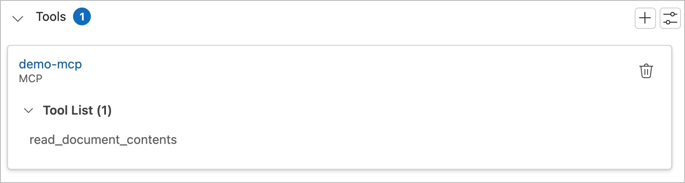
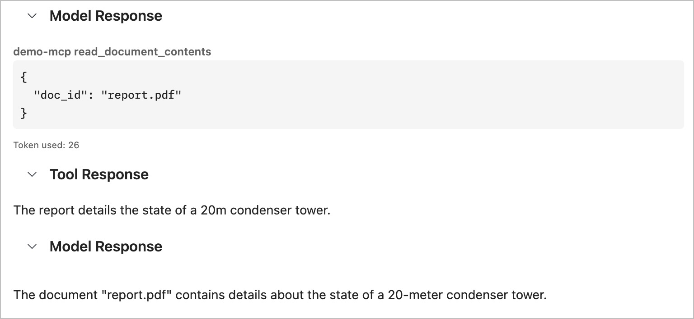
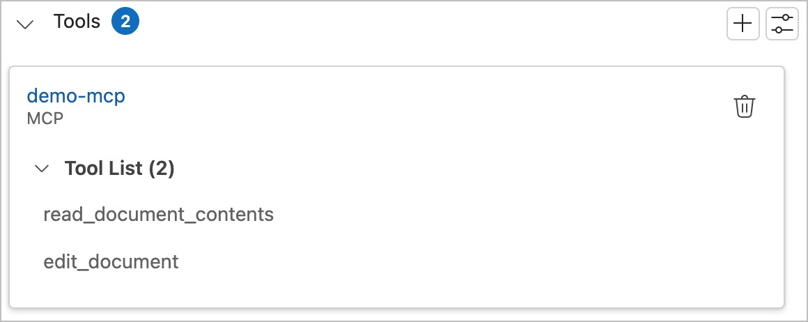
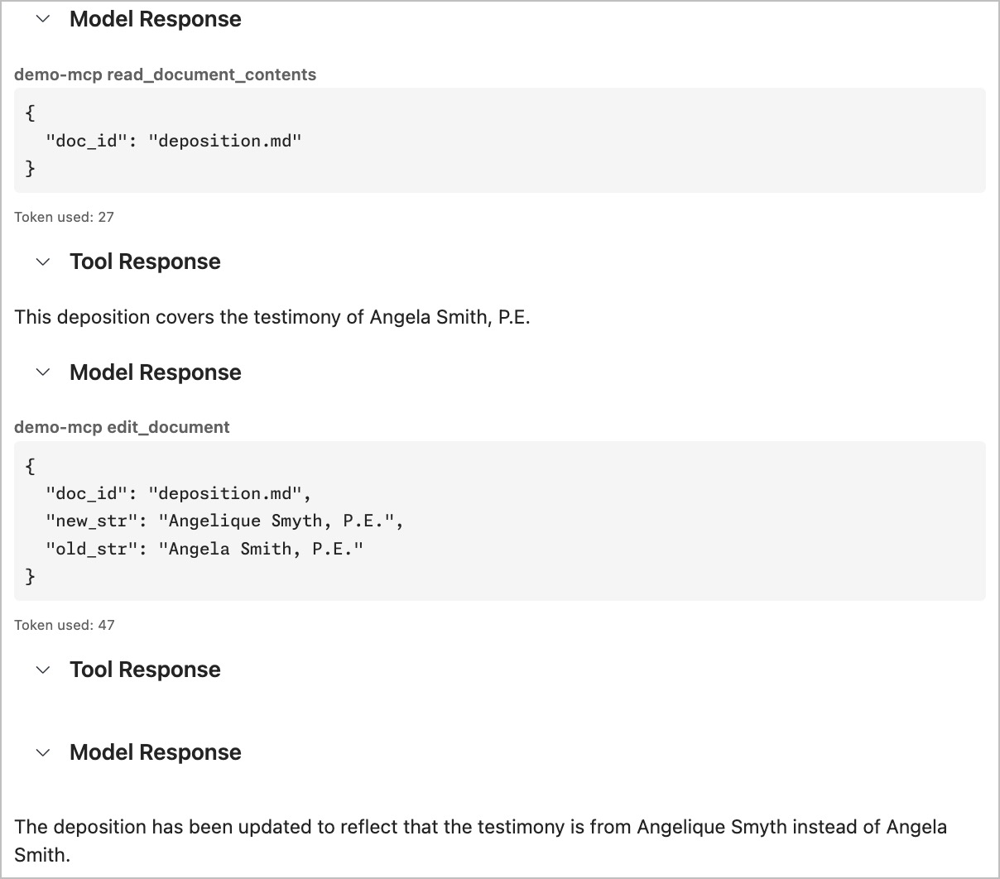

# Creating MCP Tools

The first, and most common use of an MCP server is to define tools which agents can use. Open the `src/server.py` file. The imports and documents are already configured for you.

## Table of Contents

1. [Create the `read_document` tool](#task-1-create-the-read_document-tool)
1. [Test the `read_document` tool](#task-2-test-the-read_document-tool)
1. [Create the `edit_document` tool](#task-3-create-the-edit_document-tool)
1. [Test the `edit_document` tool](#task-4-test-the-edit_document-tool)
1. ADVANCED: [Create a tool to create a new document](#task-5-add-a-tool-to-create-a-document)

## Task 1: Create the `read_document` tool

Find the following comment in `server.py`: `# TODO: Write a tool to read a doc`. In its place we will create a new function that will retrieve a document from the document store.

```python
def read_document(
  doc_id: str
):
  if doc_id not in docs:
    raise ValueError(f"Document with id {doc_id} not found")
  
  return docs[doc_id]
```

This is a simple function which takes the ID of a document (in our case the "filename") and returns the contents of the document. We also take a quick moment to verify that the requested document actually exists. We don't want our server crashing!

Having created the function to retrieve the document, we now need to make it available for our agents to use. The [FastMCP](https://gofastmcp.com/getting-started/welcome) package make this easy, allowing us to use decorators to annotate our functions. Let's add the `tool` decorator to our function to make it available to agents. Add the following code right before the function definition:

```python
@mcp_server.tool(
    name="read_document_contents",
    description="Read the contents of a document and return it as a string.",
)
```

This decorator tells FastMCP that we are adding a `tool` to our `mcp_server`. The tool is called `read_document_contents` (this is the name the Agent will see), and we provide a description to help the agent know when to use this tool and what to expect in response.

We also need to make one more update, this time to the function argument. Let's add a description (leveraging `Field` from `pydantic`) to help the agent know what information should be provided to the function call.

```python
    doc_id: str = Field(description="Id of the document to read"),
```

This gives us a full function definition as follows:

```python
@mcp_server.tool(
    name="read_document_contents",
    description="Read the contents of a document and return it as a string.",
)
def read_document(
    doc_id: str = Field(description="Id of the document to read"),
):
    if doc_id not in docs:
        raise ValueError(f"Document with id {doc_id} not found")

    return docs[doc_id]
```

## Task 2: Test the `read_document_contents` tool

To test the functionality of our tool, we can use the AI Toolkit extension. To make things easier, a debug task is created to start the MCP server and load it in the AI Toolkit panel. Press `F5` to start the debugger.

In the *Agent Builder* tab we can run a test of our MCP server. Under **Tools** you should see the `demo_mcp` server listed, with one tool available. Expand the list of tools to view the available tools.



To verify the tool works, in the **User Prompt** ask the agent to return the contents of one of the files. For example, you could ask "What is the contents of report.pdf?" Click the **Run** button at the bottom of the pane. You will see the details of the agent's process in the right-hand pane, where it will show the call to the `read_document_contents` tool, the response from the tool, and finally the response from the LLM.



Once you are finished testing, click the disconnect button on the debug panel, or press ⇧F5 to shut down your server.

## Task 3: Create the `edit_document` tool

Creating the `edit_document` tools works much the same as the `read_document` one. Find the following comment in `server.py`: `# TODO: Write a tool to edit a doc`. In place of this comment, either copy the below function, or take on the challenge to write it yourself.

```python
@mcp_server.tool(
    name="edit_document",
    description="Edit a document by replacing a string in the documents content with a new string",
)
def edit_document(
    doc_id: str = Field(description="Id of the document that will be edited"),
    old_str: str = Field(
        description="The text to replace. Must match exactly, including whitespace"
    ),
    new_str: str = Field(
        description="The new text to insert in place of the old text"
    ),
):
    if doc_id not in docs:
        raise ValueError(f"Document with id {doc_id} not found")

    docs[doc_id] = docs[doc_id].replace(old_str, new_str)
```

In a similar vein to our `read_document_contents` function above, this tool takes a document name as a parameter and checks for the document's existence. It also takes two strings - the old text to replace and the new text to insert in place.

## Task 4: Test the `edit_document` tool

To test the functionality of our tool, we can use the AI Toolkit extension. To make things easier, a debug task is created to start the MCP server and load it in the AI Toolkit panel. Press `F5` to start the debugger.

In the *Agent Builder* tab we can run a test of our MCP server. Under **Tools** you should see the `demo_mcp` server listed, with one tool available. Expand the list of tools to view the available tools.



To verify the tool works, in the **User Prompt** ask the agent to return the contents of one of the files. For example, you could ask "Please update deposition.md to reflect that the testimony is from Angelique Smyth not Angela Smith." Click the **Run** button at the bottom of the pane. You will see the details of the agent's process in the right-hand pane, where it will show the call to the `read_document_contents` tool to get the current text, the response from the tool, the LLM's request to use the `edit_document` tool to update the file, and finally the response from the LLM to the user.



Once you are finished testing, click the disconnect button on the debug panel, or press ⇧F5 to shut down your server.

🎉 Congratulations 🎉! You have successfully created an MCP server with tools for an LLM to use!

## Task 5: Add a tool to create a document

For an extra challenge, try adding a new tool which allows the creation of a new document. Make sure to include error handling! For an example solution, check out [the completed `server.py`](https://github.com/oWretch/building-mcp-servers/blob/complete/src/server.py).
