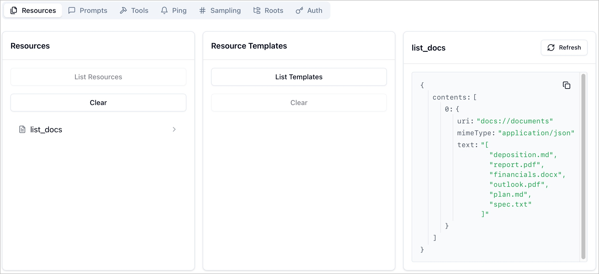
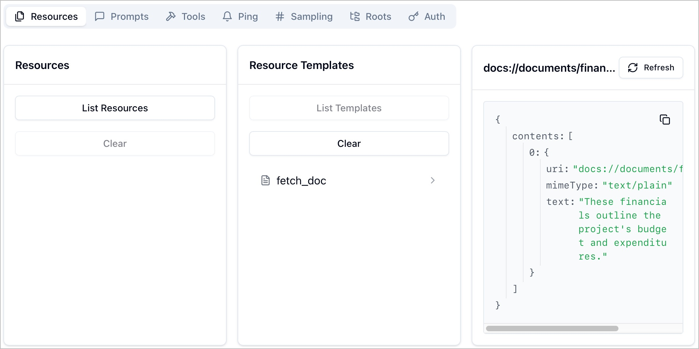

# Creating MCP Resources

Frequently with an MCP server you want allow your MCP client to discover what the server can access. For example, when using the GitHub MCP server you may want your LLM to be able to get a list of all the repositories you have access too. This list could then be used to help you select the corect repository where you wish you action to be taken (e.g. open a Pull Request). In an MCP server, this information is provided through **resources**.

## Table of Contents

1. [Allow LLM to get a list of documents](#task-1-allow-listing-of-documents)
1. [Test listing documents](#task-2-test-document-listing)
1. [Defining a Templated Resource](#task-3-defining-a-templated-resource)
1. [Test the `edit_document` tool](#task-4-test-the-edit_document-tool)

## Task 1: Allow Listing of Documents

Our first task is to allow the LLM to list the available documents our server can access. In `src/server.py` search for the comment `# TODO: Write a resource to return all doc id's`. As with other tasks, feel free to copy the function below, or take on the challenge to write it yourself.

```python
@mcp_server.resource("docs://documents", mime_type="application/json")
def list_docs() -> list[str]:
    return list(docs.keys())
```

Our function is pretty simple—just return a list of the documents we have loaded in memory. The decorator is more interesting, and an important part of the resource request. 

Our first annotation is the URI that represents our resource. In our situation, we use the `docs` scheme to indicate that the LLM will need to access the resource through our MCP server (as opposed to the `https` scheme which indicates that the LLm could access it directly over the internet). We then define a root of `documents` which (like the FQDN of a web URI) distinguishes different sources on the same scheme.

The second annotation is the format of response the server will return. In our case we will return a JSON list for the client and LLM to parse.

## Task 2: Test Document Listing

Sadly, the AI Toolkit (and GitHub Copilot in general) doesn't support resources from an MCP server. So we will have to test in a different way. First, we will use the [MCP Inspector](https://github.com/modelcontextprotocol/inspector) tool to see what is happening on our server. Let's load the inspector by opening the command palette (Ctrl+Shift+P on Windows/Linux or ⇧⌘P on macOS) and search for **Tasks: Run Task**. Select **MCP Inspector** and run the task. You will see two output windows side-by-side in the Panel. These show the output of the Server and Inspector tasks. 

Once the Inspector has started, click on the link in the inspector window, which will open your local browser and load the inspector. Click the **Connect** button in the browser window, and the inspector will connect to your MCP server.

Make sure **Resources** is selected in the inspector navigation bar, and click **List Resources**. You should see the `list_docs` command available to you. Click on **list_docs**. In the right-hand pane, you will see the output of the command.



After checking that everything works, close your browser tab, then in VS Code open the command palette, and run the **Terminate All Tasks** task to close down your MCP server and the inspector.

## Task 3: Defining a Templated Resource

In task 1, we created a "direct resource" which is a resource that is always available. It works well for a URI that doesn't change (such as a listing of available resources, as we did). But it would be impractical to try and list every possible resource that is available in an MCP server. Just think of the maintenance headache if GitHub had to update the list of repositories everytime someone created or deleted one! This is where templated resources come into play. Within a templated resource, we define one or more parameters that must be provided to allow the server to fetch a resource. This allows one function to server many resources.

For our MCP server, we will create a templated resource to fetch a specific document. While our implementation for this course will serve almost the same function as the `read_document_contents` tool from the previous section, in a real document MCP server we would probably also return metadata about the document, such as file size, date modified, etc.

To create our templated resource, search `src/server.py` for the comment `# TODO: Write a resource to return the contents of a particular doc`. A sample function is listed below, or you can create your own.

```python
@mcp_server.resource("docs://documents/{doc_id}", mime_type="text/plain")
def fetch_doc(doc_id: str) -> str:
    if doc_id not in docs:
        raise ValueError(f"Document with id {doc_id} not found")
    return docs[doc_id]
```

Notice two key differences between this resource and the `list_document` one we wrote earlier. The first is that the URI in the decorator has a variable defined - the `{doc_id}`. This tells the LLM that it will need to provide a URI with a single path item. Then, the function itself has a parameter. The variable is passed as the parameter, and we return the contents of the document. With this, we set the `mime_type` of the return value to indicate that plain text is returned.

## Task 4: Verify Your Templated Resource

To verify that our Templated Resource works, again use the command palette to run the **MCP Inspector** task. Once the Inspector has started, click on the link in the inspector window, which will open your local browser and load the inspector. Click the **Connect** button in the browser window, and the inspector will connect to your MCP server.

Make sure **Resources** is selected in the inspector navigation bar, and click **List Templates**. You should see the `fetch_doc` command available to you. Click on **fetch_doc**, and in the right-hand pane click on **Enter doc_id** and type in `financials.docx`, then click **Read Resource**. The pane will be replaced with the output of the command, which should be the contents of your file.



After checking that everything works, close your browser tab, then in VS Code open the command palette, and run the **Terminate All Tasks** task to close down your MCP server and the inspector.
